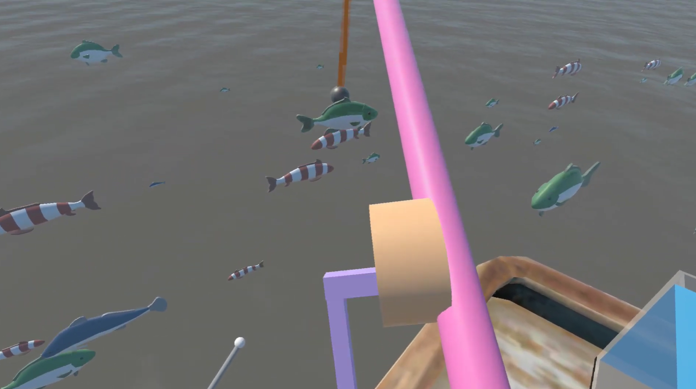
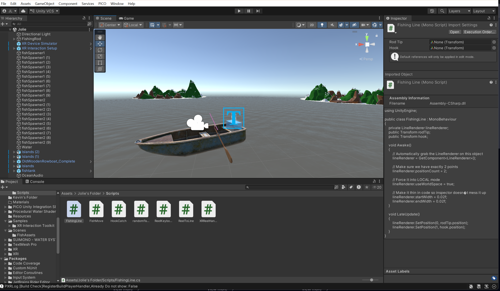

# Something's Fishy

A virtual reality fishing game developed in Unity for the PICO XR headset as part of Stanford's CS11SI: Introduction to Virtual Reality Design.

## Demo

[PICO Gameplay Demo](https://www.youtube.com/watch?v=1VS0IfzcgBE)

## Overview

Something's Fishy places players on a fishing boat in the open ocean where they can catch fish using an interactive fishing rod. Players reel in fish, manage their catches, and explore a dynamic marine environment designed for immersive VR gameplay.

## Features

* VR fishing rod with reeling mechanics
* Collision-based fish catching system
* Multiple fish species with randomized spawning
* Ocean environment with boat, water, islands, and mountains
* Fish tank for storing catches
* Hand-based VR interactions using PICO XR controllers

## Tech Stack

* Unity
* C#
* PICO XR
* Git/GitHub

## Future Work

* Educational field guide that displays information when fish are caught
* Fish species and conservation education
* Endangered fish identification and tagging mechanics
* Sustainable fishing decision-making gameplay
* Improved fish behaviors and movement
* Audio and haptic feedback for greater immersion

## Acknowledgments

Special thanks to the CS11SI teaching team for their support and guidance throughout the project! 
